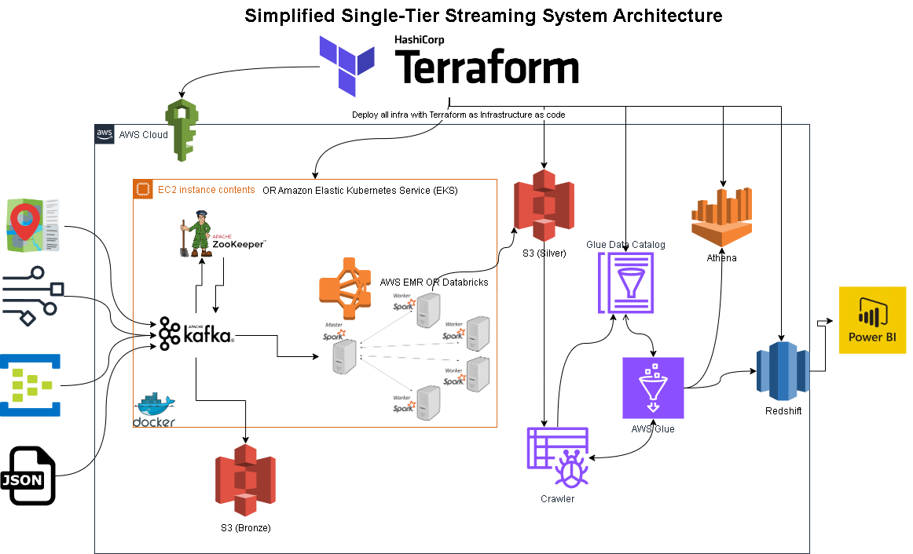

# Smart City Infrastructure Project

## Overview
This project presents a robust smart city streaming system designed to leverage real-time data for urban management and analytics. By utilizing a variety of AWS services, Apache Kafka, Docker, and Terraform, the infrastructure supports the simulation of vehicle movements and environmental conditions within a city.

## Architecture
The system architecture is built upon a single-tier streaming system, simplified for efficient deployment using Terraform as Infrastructure as Code (IaC). The following components are integrated:

### Data Generation
- **`generate_data.py`**: Simulates GPS, traffic camera, weather, and emergency incident data in real-time.

### Data Streaming
- **Apache Kafka**: Orchestrates real-time data flow from various sources (e.g., vehicles, GPS, traffic cameras).
- **Zookeeper**: Manages Kafka's state within the distributed system.

### Data Processing
- **AWS EMR or Databricks**: Processes large-scale data using Apache Spark.
- **Spark Jobs**: Defined in `spark-city.py`, they perform data transformation and aggregation tasks.

### Data Storage
- **Amazon S3**: Stores processed data in a tiered storage system (Bronze, Silver, Gold) for scalability and cost-efficiency.
- **Glue Data Catalog**: Serves as a centralized metadata repository.

### Data Analysis and Reporting
- **AWS Athena**: Provides SQL-based querying for quick analysis.
- **AWS Redshift**: A data warehouse solution for more complex queries and historical data analysis.
- **Power BI**: Offers visualization and business intelligence capabilities.

### Deployment Automation
- **Terraform (`main.tf` and `provider.tf`)**: Automates the provisioning of the cloud infrastructure.
- **Docker (`docker-compose.yml`)**: Containerizes applications for consistency across environments.

### Cloud Providers
- **AWS**: Hosts and manages cloud resources, including compute instances (EC2 or EKS), storage (S3), and data analytics services (EMR, Glue, Athena, Redshift).

## Getting Started

### Prerequisites
- AWS account
- Terraform installed
- Docker installed
- Apache Kafka and Zookeeper knowledge
- Familiarity with Python, Spark, and streaming data concepts

### Deployment
1. **Infrastructure Setup**: Use Terraform to provision the AWS resources by running `terraform apply` with the provided `main.tf` and `provider.tf`.
2. **Data Simulation**: Run `generate_data.py` to start the simulation of smart city data.
3. **Data Streaming**: Use `docker-compose` to launch the Kafka and Zookeeper services.
4. **Data Processing**: Submit the Spark job `spark-city.py` to process the streaming data.
5. **Data Storage**: Configure S3 buckets according to the tiered storage structure.
6. **Data Cataloging**: Set up the Glue Data Catalog for metadata management.
7. **Analysis & Reporting**: Use Athena and Redshift for data querying and Power BI for visualization.

### Usage
After deployment, the system will simulate a smart city's data infrastructure, allowing for real-time monitoring and analytics of vehicle movements, traffic conditions, and environmental data.